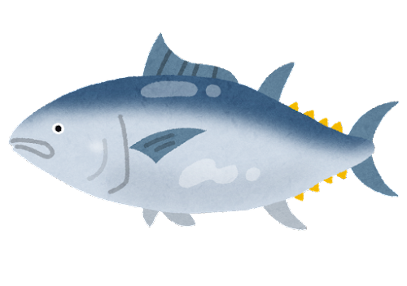

This is my first post on my new fake blog! How exciting!

I'm sure I'll write a lot more interesting things in the future.

Oh, and here's a great quote from this Wikipedia on
[maguro ](https://en.wikipedia.org/wiki/Tuna).

> A tuna is a saltwater fish that belongs to the tribe Thunnini, a subgrouping of the Scombridae (mackerel) family.
> The Thunnini comprise 15 species across five genera,[2] the sizes of which vary greatly,
> ranging from the bullet tuna (max length: 50 cm or 1.6 ft, weight: 1.8 kg or 4 lb) up to the Atlantic bluefin tuna (max length: 4.6 m or 15 ft, weight: 684 kg or 1,508 lb),
> which averages 2 m (6.6 ft) and is believed to live up to 50 years.
> 

You can also write code blocks here!

```js
const saltyDuckEgg = "chinese preserved food product";
```

[View raw (TEST.md)](https://raw.github.com/adamschwartz/github-markdown-kitchen-sink/master/README.md)

This is a paragraph.

    This is a paragraph.

# Header 1

## Header 2

    Header 1
    ========

    Header 2
    --------

# Header 1

## Header 2

### Header 3

#### Header 4

##### Header 5

###### Header 6

    # Header 1
    ## Header 2
    ### Header 3
    #### Header 4
    ##### Header 5
    ###### Header 6

# Header 1

## Header 2

### Header 3

#### Header 4

##### Header 5

###### Header 6

    # Header 1 #
    ## Header 2 ##
    ### Header 3 ###
    #### Header 4 ####
    ##### Header 5 #####
    ###### Header 6 ######

> Lorem ipsum dolor sit amet, consectetuer adipiscing elit. Aliquam hendrerit mi posuere lectus. Vestibulum enim wisi, viverra nec, fringilla in, laoreet vitae, risus.
> Lorem ipsum dolor sit amet, consectetuer adipiscing elit. Aliquam hendrerit mi posuere lectus. Vestibulum enim wisi, viverra nec, fringilla in, laoreet vitae, risus.
>
> ## This is a header.
>
> 1. This is the first list item.
> 2. This is the second list item.
>
> Here's some example code:
>
>     Markdown.generate();
>
> ## This is a header.
>
> 1. This is the first list item.
> 2. This is the second list item.
>
> Here's some example code:
>
>     Markdown.generate();

- Red
- Green
- Blue

* Red
* Green
* Blue

- Red
- Green
- Blue

```markdown
- Red
- Green
- Blue

* Red
* Green
* Blue

- Red
- Green
- Blue
```

- `code goes` here in this line
- **bold** goes here

```markdown
- `code goes` here in this line
- **bold** goes here
```

1. Buy flour and salt
1. Mix together with water
1. Bake

```markdown
1. Buy flour and salt
1. Mix together with water
1. Bake
```

1. `code goes` here in this line
1. **bold** goes here

```markdown
1. `code goes` here in this line
1. **bold** goes here
```

Paragraph:

    Code
    Paragraph:

        Code

---

---

---

---

---

    * * *

    ***

    *****

    - - -

    ---------------------------------------

This is [an example](http://example.com "Example") link.

[This link](http://example.com) has no title attr.

This is [an example][id] reference-style link.

[id]: http://example.com "Optional Title"

    This is [an example](http://example.com "Example") link.

    [This link](http://example.com) has no title attr.

    This is [an example] [id] reference-style link.

    [id]: http://example.com "Optional Title"

_single asterisks_

_single underscores_

**double asterisks**

**double underscores**

    *single asterisks*

    _single underscores_

    **double asterisks**

    __double underscores__

This paragraph has some `code` in it.

    This paragraph has some `code` in it.


    
