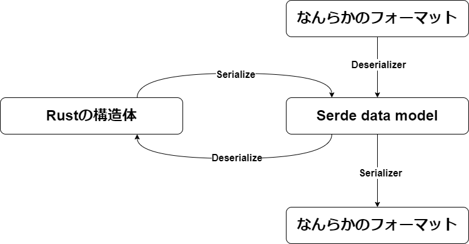

serdeの入門として、`serde::Serializer`と`serde::Deserializer`を実装したので、`serde`について理解したことを記録として残します

https://github.com/tunamaguro/messagepack-rs

```rust
use serde::{Deserialize, Serialize};

#[derive(Debug, Serialize, Deserialize, PartialEq)]
struct Data<'a> {
    compact: bool,
    schema: u8,
    less: &'a str,
}

let buf: &[u8] = &[
    0x83, 0xa7, 0x63, 0x6f, 0x6d, 0x70, 0x61, 0x63, 0x74, 0xc3, 0xa6, 0x73, 0x63, 0x68,
    0x65, 0x6d, 0x61, 0x00, 0xa4, 0x6c, 0x65, 0x73, 0x73, 0xa9, 0x74, 0x68, 0x61, 0x6e,
    0x20, 0x6a, 0x73, 0x6f, 0x6e,
];

let data = messagepack_serde::from_slice::<Data<'_>>(buf).unwrap();
let expected = Data {
    compact: true,
    schema: 0,
    less: "than json",
};
assert_eq!(data, expected);

let mut deserialized = [0u8; 33];
let len = messagepack_serde::to_slice(&expected, &mut deserialized).unwrap();
assert_eq!(&deserialized[..len], buf);
```

既存実装の[rmp-serde](https://crates.io/crates/rmp-serde)より機能を削ぎ落している分少しだけ早いです。

- シリアライズ
  - [messagepack_serdeベンチマーク](https://codspeed.io/tunamaguro/messagepack-rs/benchmarks/crates/messagepack-bench/benches/serialization.rs::serializer_messagepack_serde%5BCompositeType%2C%2032%5D): 6.5ms
  - [rmp_serdeベンチマーク](https://codspeed.io/tunamaguro/messagepack-rs/benchmarks/crates/messagepack-bench/benches/serialization.rs::serializer_rmp_serde%5BCompositeType%2C%2032%5D): 8.4ms
- デシリアライズ
  - [messagepack_serdeベンチマーク](https://codspeed.io/tunamaguro/messagepack-rs/benchmarks/crates/messagepack-bench/benches/deserialization.rs::deserializer_messagepack_serde%5BCompositeType%2C%2032%5D): 8.6ms
  - [rmp-serdeベンチマーク](https://codspeed.io/tunamaguro/messagepack-rs/benchmarks/crates/messagepack-bench/benches/deserialization.rs::deserializer_rmp_serde%5BCompositeType%2C%2032%5D): 10.49ms

`no_std`対応ですが実装はかなり雑なので、バグがある可能性が高いです

## 実装参考

- https://serde.rs/impl-serializer.html
- https://serde.rs/impl-deserializer.html

## 作った理由

単純に勉強目的で作成しました。RustでWeb周りを触る際、[serde](https://github.com/serde-rs/serde)や[serde-json](https://github.com/serde-rs/json)を使うことが多いと思いますが、
なぜ`serde_json::from_str(data)`でデータをパースできるのか分からなかったため「とりあえずやってみたら理解できるか...」という気持ちで始めました。

## Serde data model

実装するうえでもっとも重要だと感じたのは、この[Serde data model](https://serde.rs/data-model.html)です。
`Serializer`や`Deserializer`は任意のフォーマットから、`Serde data model`に値を変換することのみを役割としています。
つまり`Serializer`は`Serde data model`を何らかのフォーマットに変換するもの。`Deserializer`は何らかのフォーマットをパースしながら、`Serde data model`へ値をマッピングしていく形です。
図にするとこんな感じです



いったん`Serde data model`を経由することで、変換先と変換元でN×M個の実装が必要になるのを、N+M個に抑えているのだと思います

## Serializerの実装

[`Serializer`の実装はここにあります](https://github.com/tunamaguro/messagepack-rs/tree/main/crates/messagepack-serde/src/ser)

今回実装するフォーマットとして[MessagePack](https://github.com/msgpack/msgpack/blob/master/spec.md)を選択しました。
仕様が小さいこと、machine readableなこと、JSONに構造が近いため`serde-json`が実装参考になりそうなことが理由です。

`Serializer`は[トレイトで要求されている28個のメソッド](https://docs.rs/serde/latest/serde/trait.Serializer.html#required-methods)を実装する形になります。
`i8`や`str`のようなprimitive typeはそのままなので難しくなく引数に流れてくる値を変換して書き込むだけです。
`serialize_some`に関しては少し違い、`Option<T>`の中身、つまり何らかの`Serialize`が実装された値が渡されるので、そのメソッドをそのまま呼び出します。
呼び出す先は`serialize_i8`などのメソッドですが、その辺は`Serialize`トレイトが決定するので`Serializer`は知る必要はありません

```rust
    fn serialize_bool(self, v: bool) -> Result<Self::Ok, Self::Error> {
        self.current_length += v.encode_to_iter_mut(self.buf.by_ref())?;
        Ok(())
    }

    fn serialize_i8(self, v: i8) -> Result<Self::Ok, Self::Error> {
        self.current_length += v.encode_to_iter_mut(self.buf.by_ref())?;
        Ok(())
    }

    fn serialize_str(self, v: &str) -> Result<Self::Ok, Self::Error> {
        self.current_length += v.encode_to_iter_mut(self.buf.by_ref())?;
        Ok(())
    }

// snip

    fn serialize_bytes(self, v: &[u8]) -> Result<Self::Ok, Self::Error> {
        self.current_length += BinaryEncoder(v).encode_to_iter_mut(self.buf.by_ref())?;
        Ok(())
    }

    fn serialize_none(self) -> Result<Self::Ok, Self::Error> {
        self.current_length += NilEncoder.encode_to_iter_mut(self.buf.by_ref())?;
        Ok(())
    }

    fn serialize_some<T>(self, value: &T) -> Result<Self::Ok, Self::Error>
    where
        T: ?Sized + ser::Serialize,
    {
        value.serialize(self)
    }
```

> https://github.com/tunamaguro/messagepack-rs/blob/main/crates/messagepack-serde/src/ser/mod.rs#L55-L137

続いて`seq`や`tuple`のシリアライズを実装します。`Serde data model`と対応するRustの構造体は次のような形になります

```rust
// seq
let _ = Vec::<u8>::new();
// tuple
let _ = ("123",456,7.89);
// tuple_struct
struct S(bool, i32)
```

これらのシリアライズは`Serializer`ではなく、`SerializeSeq`や`SerializeTupleStruct`という別のトレイトで行います。
今回の実装では、これらはすべてMessagePackのArrayとしてシリアライズすることにしたため、同じ構造体にまとめて実装しました。
各要素ごとに`SerializeSeq::serialize_element`が順に呼び出されるようになっているみたいです。
そのため今回は`Serializer`側でArrayのフォーマットだけ書き込み（長さごとに用いるフォーマットが違うため）、中身のシリアライズのみ`SerializeSeq`で行っています。

```rust
// Serializer側(mod.rs)

    fn serialize_seq(self, len: Option<usize>) -> Result<Self::SerializeSeq, Self::Error> {
        let len = len.ok_or(Error::SeqLenNone)?;
        self.current_length +=
            ArrayFormatEncoder::new(len).encode_to_iter_mut(self.buf.by_ref())?;
        Ok(seq::SerializeSeq::new(self))
    }

    fn serialize_tuple(self, len: usize) -> Result<Self::SerializeTuple, Self::Error> {
        self.current_length +=
            ArrayFormatEncoder::new(len).encode_to_iter_mut(self.buf.by_ref())?;
        Ok(seq::SerializeSeq::new(self))
    }

    fn serialize_tuple_struct(
        self,
        _name: &'static str,
        len: usize,
    ) -> Result<Self::SerializeTupleStruct, Self::Error> {
        self.current_length +=
            ArrayFormatEncoder::new(len).encode_to_iter_mut(self.buf.by_ref())?;
        Ok(seq::SerializeSeq::new(self))
    }

// SerializeSeq側(seq.rs)
impl<'a, 'b, Buf> SerializeSeq<'a, 'b, Buf> {
    pub(crate) fn new(ser: &'a mut Serializer<'b, Buf>) -> Self {
        Self { ser }
    }
}

impl<'b, Buf> ser::SerializeSeq for SerializeSeq<'_, 'b, Buf>
where
    Buf: Iterator<Item = &'b mut u8>,
{
    type Ok = ();
    type Error = Error;

    fn serialize_element<T>(&mut self, value: &T) -> Result<(), Self::Error>
    where
        T: ?Sized + ser::Serialize,
    {
        value.serialize(self.ser.as_mut())
    }

    fn end(self) -> Result<Self::Ok, Self::Error> {
        Ok(())
    }
}

impl<'b, Buf> ser::SerializeTuple for SerializeSeq<'_, 'b, Buf>
where
    Buf: Iterator<Item = &'b mut u8>,
{
    type Ok = ();
    type Error = Error;

    fn serialize_element<T>(&mut self, value: &T) -> Result<(), Self::Error>
    where
        T: ?Sized + ser::Serialize,
    {
        ser::SerializeSeq::serialize_element(self, value)
    }

    fn end(self) -> Result<Self::Ok, Self::Error> {
        ser::SerializeSeq::end(self)
    }
}
```

次に`map`用の実装をします。`map`は`HashMap`のようなキーとバリューのペアを持つ構造体に対応します。
こちらも`seq`と同様に`SerializeMap`というトレイトが用意されているので、そちらに実装します。
`serialize_key`と`serialize_value`が順に呼び出されるので、それを順にシリアライズするだけです。
`struct`も同様なので、[詳細は実装を確認してください](https://github.com/tunamaguro/messagepack-rs/blob/dae3f35c355087a7923411579f1c0c6bd9159f8d/crates/messagepack-serde/src/ser/map.rs#L9-L58)

```rust
// Serializer側(mod.rs)
    fn serialize_map(self, len: Option<usize>) -> Result<Self::SerializeMap, Self::Error> {
        let len = len.ok_or(Error::SeqLenNone)?;
        self.current_length += MapFormatEncoder::new(len).encode_to_iter_mut(self.buf.by_ref())?;
        Ok(map::SerializeMap::new(self))
    }

// SerializeMap側(map.rs)
pub struct SerializeMap<'a, 'b, Buf> {
    ser: &'a mut Serializer<'b, Buf>,
}

impl<'a, 'b, Buf> SerializeMap<'a, 'b, Buf> {
    pub(crate) fn new(ser: &'a mut Serializer<'b, Buf>) -> Self {
        Self { ser }
    }
}

impl<'b, Buf> ser::SerializeMap for SerializeMap<'_, 'b, Buf>
where
    Buf: Iterator<Item = &'b mut u8>,
{
    type Ok = ();
    type Error = Error;

    fn serialize_key<T>(&mut self, key: &T) -> Result<(), Self::Error>
    where
        T: ?Sized + ser::Serialize,
    {
        key.serialize(self.ser.as_mut())
    }

    fn serialize_value<T>(&mut self, value: &T) -> Result<(), Self::Error>
    where
        T: ?Sized + ser::Serialize,
    {
        value.serialize(self.ser.as_mut())
    }

    fn end(self) -> Result<Self::Ok, Self::Error> {
        Ok(())
    }
}
```

残っているのは`XXX_variant`系のモノです。これらは4つありそれぞれ`enum`の要素に対応しています

```rust
enum S{
    UnitVariant, // unit_variant
    NewTypeVariant(bool), // newtype_variant
    TupleVariant(u8,u8), // tuple_variant
    StructVariant{a:u8}, // struct_variant
}
```

今回は`unit_variant`を文字列、`newtype_variant`をその中身、`tuple_variant`および`struct_variant`をその名前をキーにした構造体にマッピングします。
以下はJSONでの変換イメージです

```rust
S::UnitVariant // -> "UnitVariant"
S::NewTypeVariant // -> true
S::TupleVariant(1,2) // -> {"TupleVariant":[1,2]}
S::StructVariant{a:3} // -> {"StructVariant":{"a":3}}
```

実装は以下のようになります。`tuple_variant`および`struct_variant`は`seq`や`map`と同様にそれ専用のトレイトがあるので、そちらの実装が必要です

```rust
    fn serialize_unit_variant(
        self,
        _name: &'static str,
        _variant_index: u32,
        variant: &'static str,
    ) -> Result<Self::Ok, Self::Error> {
        self.serialize_str(variant)
    }

// snip

    fn serialize_newtype_variant<T>(
        self,
        _name: &'static str,
        _variant_index: u32,
        variant: &'static str,
        value: &T,
    ) -> Result<Self::Ok, Self::Error>
    where
        T: ?Sized + ser::Serialize,
    {
        self.current_length += MapFormatEncoder::new(1).encode_to_iter_mut(self.buf.by_ref())?;
        self.serialize_str(variant)?;
        value.serialize(self.as_mut())
    }

// snip

    fn serialize_tuple_variant(
        self,
        _name: &'static str,
        _variant_index: u32,
        variant: &'static str,
        len: usize,
    ) -> Result<Self::SerializeTupleVariant, Self::Error> {
        self.current_length += MapFormatEncoder::new(1).encode_to_iter_mut(self.buf.by_ref())?;
        self.serialize_str(variant)?;
        self.current_length +=
            ArrayFormatEncoder::new(len).encode_to_iter_mut(self.buf.by_ref())?;
        Ok(seq::SerializeSeq::new(self))
    }

// snip

    fn serialize_struct_variant(
        self,
        name: &'static str,
        _variant_index: u32,
        variant: &'static str,
        len: usize,
    ) -> Result<Self::SerializeStructVariant, Self::Error> {
        self.current_length += MapFormatEncoder::new(1).encode_to_iter_mut(self.buf.by_ref())?;
        self.serialize_str(variant)?;
        self.serialize_struct(name, len)
    }
```

残っている`Serde data model`の`unit`や`newtype_struct`などを実装すれば`Serializer`は完成です。
これはテストを書いていて気付いたことですが、`serde`のデフォルトでは`&[u8]`をシリアライズする際に、
`Serializer::serialize_bytes`ではなく`Serializer::serialize_seq`が呼ばれます。大きいバイト列などではこの速度差は8~9倍あり遅いため、バイト列を使う場合は[serde-bytes](https://docs.rs/serde_bytes/latest/serde_bytes/)を使いましょう。
構造体であれば`#[serde(with = "serde_bytes")]`をつけるだけ、そのままの`&[u8]`であれば次のようにして使えます

```rust
    #[test]
    fn encode_bytes() {
        // default &[u8] not call serialize_bytes
        let v = serde_bytes::Bytes::new(&[5, 4, 3, 2, 1, 0]);

        let buf = &mut [0u8; 128];
        let len = to_slice(&v, buf).unwrap();
        assert_eq!(buf[..len], [0xc4, 0x06, 0x05, 0x04, 0x03, 0x02, 0x01, 0x00]);
    }
```

> [`serde_bytes`を使ったとき](https://codspeed.io/tunamaguro/messagepack-rs/benchmarks/crates/messagepack-bench/benches/serialization.rs::serializer_messagepack_serde%5BByteType%2C%2032%5D): 450us  
> [`serde_bytes`を使わないとき](https://codspeed.io/tunamaguro/messagepack-rs/benchmarks/crates/messagepack-bench/benches/serialization.rs::serializer_messagepack_serde%5BArrayTypes%2C%2032%5D): 3.2ms

## Deserializerの実装

[`Deserializer`の実装はここにあります](https://github.com/tunamaguro/messagepack-rs/tree/main/crates/messagepack-serde/src/de)

こちらは`Serializer`の逆でバイト列を`Serde data model`に変換します。こちらも`Serde data model`の数だけメソッドが必要です。
今回は`Deserializer`を次のように定義しました。`Deserializer`周りで毎回出てくる謎のライフタイム`'de`は、入力のバイト列などの参照を指していたことがわかります

```rust
#[derive(Debug, Clone, PartialOrd, Ord, PartialEq, Eq)]
pub struct Deserializer<'de> {
    input: &'de [u8],
}
```

実際にデシリアライズするコード例は次のような形です

```rust
impl<'de> Deserializer<'de> {
    pub fn from_slice(input: &'de [u8]) -> Self {
        Deserializer { input }
    }

    // 便利用の関数。Vのデコードを試して、成功すれば自身の参照先を進める
    fn decode<V: Decode<'de>>(&mut self) -> Result<V::Value, Error> {
        let (decoded, rest) = V::decode(self.input)?;
        self.input = rest;
        Ok(decoded)
    }
}

impl<'de> de::Deserializer<'de> for &mut Deserializer<'de> {
    type Error = Error;

    fn deserialize_any<V>(self, _visitor: V) -> Result<V::Value, Self::Error>
    where
        V: de::Visitor<'de>,
    {
        Err(Error::AnyIsUnsupported)
    }

    fn deserialize_bool<V>(self, visitor: V) -> Result<V::Value, Self::Error>
    where
        V: de::Visitor<'de>,
    {
        let decoded = self.decode::<bool>()?;
        visitor.visit_bool(decoded)
    }

    fn deserialize_i8<V>(self, visitor: V) -> Result<V::Value, Self::Error>
    where
        V: de::Visitor<'de>,
    {
        let decoded = self.decode::<i8>()?;
        visitor.visit_i8(decoded)
    }
// snip
```

大体の雰囲気は同じですが、見慣れない`Visitor`というものが存在しています。`Visitor`は`Deserializer`が返す値を使い実際にその構造体を作成する役目を負っています。
`serde`がデフォルトで実装している`Visitor`と`Serialize`の例を見てみます。
これを見ると`Deserialize` -> `Deserializer` -> `Visitor` -> `Deserialize`の順で呼び出されていることがわかります。

```rust
struct CharVisitor;

impl<'de> Visitor<'de> for CharVisitor {
    type Value = char;

    fn expecting(&self, formatter: &mut fmt::Formatter) -> fmt::Result {
        formatter.write_str("a character")
    }

    #[inline]
    fn visit_char<E>(self, v: char) -> Result<Self::Value, E>
    where
        E: Error,
    {
        Ok(v)
    }

    #[inline]
    fn visit_str<E>(self, v: &str) -> Result<Self::Value, E>
    where
        E: Error,
    {
        let mut iter = v.chars();
        match (iter.next(), iter.next()) {
            (Some(c), None) => Ok(c),
            _ => Err(Error::invalid_value(Unexpected::Str(v), &self)),
        }
    }
}

impl<'de> Deserialize<'de> for char {
    #[inline]
    fn deserialize<D>(deserializer: D) -> Result<Self, D::Error>
    where
        D: Deserializer<'de>,
    {
        deserializer.deserialize_char(CharVisitor)
    }
}
```

> https://github.com/serde-rs/serde/blob/v1.0.218/serde/src/de/impls.rs#L548-L586

これはただの`char`なのでまったく嬉しさがわかりませんが、次のような構造体をデシリアライズする例を考えます。

```rust
struct Color{
    r: u8,
    g: u8,
    b: u8
}
```

この構造体はカラーコードのrgbを`u8`で持ちますが、`#32cd32`のような文字列からデシリアライズしたい場合、実装は次のようになるでしょう

```rust
struct ColorVisitor;

impl<'de> serde::de::Visitor<'de> for ColorVisitor {
    type Value = Color;

    fn expecting(&self, formatter: &mut core::fmt::Formatter) -> core::fmt::Result {
        formatter.write_str("expect color code")
    }

    fn visit_str<E>(self, v: &str) -> Result<Self::Value, E>
    where
        E: serde::de::Error,
    {
        if v.len() != 7 {
            return Err(Error::custom("expect str len == 7"));
        }
        if "#" != &v[..1] {
            return Err(Error::custom("expect #"));
        };

        let r: u8 =
            u8::from_str_radix(&v[1..3], 16).map_err(|_| Error::custom("cannot parse as u8"))?;
        let g: u8 =
            u8::from_str_radix(&v[3..5], 16).map_err(|_| Error::custom("cannot parse as u8"))?;
        let b: u8 =
            u8::from_str_radix(&v[5..7], 16).map_err(|_| Error::custom("cannot parse as u8"))?;

        Ok(Color { r, g, b })
    }

    fn visit_borrowed_str<E>(self, v: &'de str) -> Result<Self::Value, E>
    where
        E: Error,
    {
        self.visit_str(v)
    }
}

impl<'de> serde::Deserialize<'de> for Color {
    fn deserialize<D>(deserializer: D) -> Result<Self, D::Error>
    where
        D: serde::Deserializer<'de>,
    {
        deserializer.deserialize_str(ColorVisitor)
    }
}
```

ここで重要なのは`serde::Deserialize`では`serde::Deserializer`の詳細を知らないにもかかわらず問題なく実装できている点です。
これは`Visitor`によって`serde::Deserialize`が`Deserializer`から渡される値をどのように構築するかの知識が切り離されているため、このように書くことができます。

他には`newtype_struct`も対応した`Visitor`があれば、それも流用して別の構造体にも使えることになります

```rust
struct NewType(bool);

struct NewTypeVisitor;

impl<'de> Visitor<'de> for NewTypeVisitor {
    type Value = NewType(bool);

    fn expecting(&self, formatter: &mut fmt::Formatter) -> fmt::Result {
        formatter.write_str("a bool")
    }

    fn visit_bool<E>(self, v: bool) -> Result<Self::Value, E>
    where
        E: Error,
    {
        Ok(NewType(v))
    }
}

struct K(NewType)

impl <'de> Deserialize<'de> for S {
    fn deserialize<D>(deserializer: D) -> Result<Self, D::Error>
    where
        D: Deserializer<'de>,
    {
        let ele1 = deserializer.deserialize_bool(NewType)?;
        Ok(Self(ele1))
    }
}
```

長々と書きましたが、つまるところ`deerialize_XXX`で要求されている値のデシリアライズを試して、成功すればその値を`Visitor`の対応するメソッドに渡せば良いわけです。
というわけでそれを地道に実装します。`seq`や`map`は`Serializer`と同じように対応するトレイト`de::SeqAccess`などを実装する形になります。

1つ嵌ったミスとして、`&str`や`&[u8]`のような借用型でデシリアライズするとき、`Visitor::visit_str`ではなく`Visitor::visit_borrowed_str`のような`visit_borrowed_XXX`を呼び出す必要があります。
[ドキュメントにも書いてありますが](https://docs.rs/serde/latest/serde/de/trait.Visitor.html#method.visit_str)`visit_str`はそのライフタイムより長く値を利用するために値をコピーするため、ゼロコピーである`&str`には使えません。
今回は`no_std`でメモリ割り当てが出来ないので、`visit_borrowed_str`を呼び出す必要があります。呼び出さないとエラーになります

👇`&str`のデシリアライズで`visit_str`を呼び出していたため、しばらく嵌っていた際のエラーメッセージ

```bash

stderr:

thread 'main' panicked at crates/messagepack-serde/src/../README.md:20:59:
called `Result::unwrap()` on an `Err` value: Message("invalid type: string \"than json\", expected a borrowed string")
note: run with `RUST_BACKTRACE=1` environment variable to display a backtrace
```

## 終わりに

とりあえず動くようにはなりましたが、機能的にはボロボロでほとんど何もできません。残りのやってみたいこととしては下のような感じです

- `std::io::Write`への対応
- `extension`周りの実装
- よりデータが小さくなるようにシリアライズ、小さい値からキャストしてデシリアライズする
- なんでも入る`Value`の実装

2日程度でできると思っていたのですが、結局5日かかりました。`Serializer`/`Deserializer`を実装することで`serde`が何をやっているのか、少しだけ理解できるようになったのは良い点だと思っています。
次は`derive`のような手続き型マクロに挑戦してみたいです
