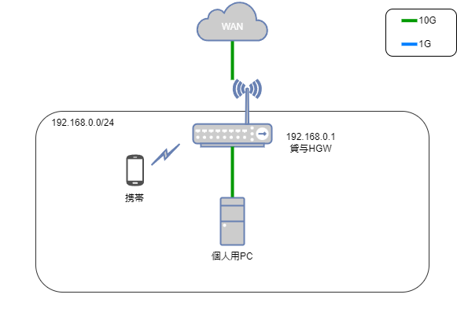
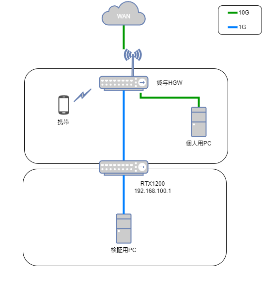
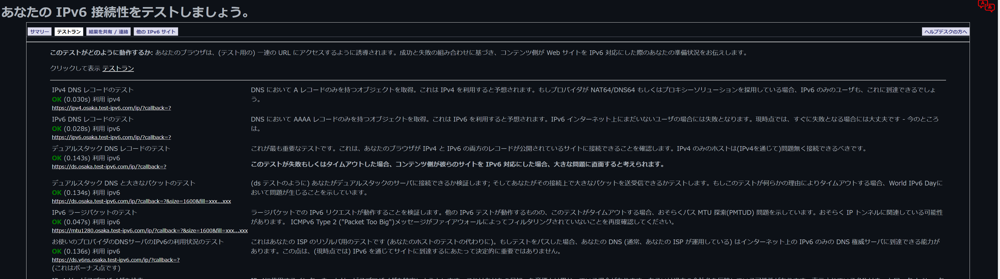

## はじめに

最近中古のRTX1200を購入し、IPv4,IPv6の設定をしたのでその個人用メモです。以下常体で記載

## 用意したもの

- RTX1200
- シリアルケーブル

## 購入理由

- [配信者のうんちゃまさん](https://www.youtube.com/channel/UCEOXpbYUlbKwt2tFvqKQ2xg)の動画を見ていてネットワーク周りを触りたい欲が出てきた
- Ciscoのものは触ったことがあったので、一度も使ったことのないYamaha製を使ってみたくなった
  - RTX1200が楽天で3000円でかなり安かった
  - 調べたらIPv6を扱うことのできるルータだったので購入

## 導入前

貸与品をそのまま使っているごくごく一般的なネットワーク



## 導入後

RTX1200が増えるだけ。HGWがあるためRTX1200は2重NAT



## 初期化 + ファームウェアのアップデート

中古で買っているので過去の設定を吹き飛ばすために初期化する。初期化は前面の`microSD`,`USB`,`DOWNLOAD`の3ボタンを押しながら電源を入れるとできる。
その後ファームウェアのアップデートを行う。今回は[取扱説明書の7.3.1のUSBを使う方法](https://www.rtpro.yamaha.co.jp/RT/manual/rtx1200/Users.pdf)でアップデートした。

準備として[ファームウェア配布ページ](https://www.rtpro.yamaha.co.jp/RT/firmware/index.php)からRTX1200のファームウェアをダウンロードし、ファイル名をrtx1200.binにしてUSBに保存する。
その後USBをRTX1200に接続し、DOWNLOADボタンを3秒以上押し続けるとファームウェアが更新される

## パスワード設定とセキュリティクラスの設定

初期のパスワードは空文字なので、Enter -> `administrator` -> Enterで管理者モードに入る。その後パスワードを新しく設定する

```bash
administrator password encrypted
login password encrypted
```

参考: https://www.rtpro.yamaha.co.jp/RT/docs/console/set-password.html

シリアルケーブル以外で操作する予定がないので、SSHやtelnetで操作できないように設定を変更する。必要があれば残しておけばよいと思う

```bash
security class 3 off off
telnet service off
```

参考: https://www.rtpro.yamaha.co.jp/RT/manual/rt-common/setup/security_class.html

設定を保存しておく

```bash
save
```

## IPv4に2重NATを設定しインターネットにつながるようにする

とりあえずネットにつながるようにLAN2にNATを設定する。アドレスはHGWからDHCPで付与してもらう

> DMZとかを使わないのは、せっかくの10Gがもったいないから

```bash
# --- DHCP ---
# lan2に割り当てられたDHCPのデフォルトゲートウェイをデフォルトゲートウェイにする
ip route default gateway dhcp lan2
# lan2はdhcpを受け取る
ip lan2 address dhcp

# --- NAT ---
# NATディスクリプタ1の変換方式をmasqueradeに変更
nat descriptor type 1 masquerade
# NATの外側アドレスはそのLANのプライマリアドレス
nat descriptor address outer 1 primary
# すべてのアドレスを内側として扱う
nat descriptor address inner 1 auto
# 外側から内側へのパケットを破棄
nat descriptor masquerade incoming 1 reject
# lan2に上のディスクリプタを設定
ip lan2 nat descriptor 1
```

参考

- https://www.rtpro.yamaha.co.jp/RT/manual/rt-common/ip/ip_route.html
- https://www.rtpro.yamaha.co.jp/RT/docs/nat-descriptor/nat-abstruct.html

疎通確認のためCloudflareのDNSにpingする

```bash
ping -c 4 1.1.1.1
1.1.1.1から受信: シーケンス番号=0 ttl=55 時間=6.985ミリ秒
1.1.1.1から受信: シーケンス番号=1 ttl=55 時間=7.060ミリ秒
1.1.1.1から受信: シーケンス番号=2 ttl=55 時間=7.031ミリ秒
1.1.1.1から受信: シーケンス番号=3 ttl=55 時間=7.162ミリ秒

4個のパケットを送信し、4個のパケットを受信しました。0.0%パケットロス
往復遅延 最低/平均/最大 = 6.985/7.059/7.162 ミリ秒
```

## DNSとNTPの設定

RTX1200が使うDNSを設定する

```bash
# DNS有効化。offにするとそもそもDNSにかかわる機能がすべて動作しない
dns service recursive
# Cloudflare DNSを設定
dns server 1.1.1.1 1.0.0.1
# プライベートIPへの解決をしない
dns private address spoof off
```

> `dns private address spoof off`は別にONでもいいかも  
> https://www.rtpro.yamaha.co.jp/RT/manual/rt-common/dns/dns_private_address_spoof.html

疎通確認

```bash
ping -c 4 www.google.com
nrt13s72-in-f4.1e100.net (142.251.222.36)から受信: シーケンス番号=0 ttl=58 時間=6.390ミリ秒
nrt13s72-in-f4.1e100.net (142.251.222.36)から受信: シーケンス番号=1 ttl=58 時間=6.625ミリ秒
nrt13s72-in-f4.1e100.net (142.251.222.36)から受信: シーケンス番号=2 ttl=58 時間=6.511ミリ秒
nrt13s72-in-f4.1e100.net (142.251.222.36)から受信: シーケンス番号=3 ttl=58 時間=6.470ミリ秒

4個のパケットを送信し、4個のパケットを受信しました。0.0%パケットロス
往復遅延 最低/平均/最大 = 6.390/6.499/6.625 ミリ秒
```

続いてNTPの設定をする。今回はCloudflareのNTPサーバ`time.cloudflare.com`を使う

```bash
timezone jst
ntpdate time.cloudflare.com
schedule at 1 startup * ntpdate time.cloudflare.com
schedule at 2 */* 5:00 * ntpdate time.cloudflare.com
schedule at 2 */* 17:00 * ntpdate time.cloudflare.com
```

参考

- https://www.rtpro.yamaha.co.jp/RT/manual/rt-common/setup/timezone.html
- https://www.rtpro.yamaha.co.jp/RT/manual/rt-common/setup/ntpdate.html
- https://www.rtpro.yamaha.co.jp/RT/manual/wlx313/schedule/schedule_at.html

## IPv6のセキュリティ周り

フィルターを設定する。CiscoでいうACL的なものだと認識している

```bash
# ふつう使わないパケットを拒否
ip filter source-route on
ip filter directed-broadcast on

# 不要なポートをブロック
# RPC
ip filter 1010 reject * * udp,tcp 135 *
ip filter 1011 reject * * udp,tcp * 135
# NetBios
ip filter 1012 reject * * udp,tcp netbios_ns-netbios_ssn *
ip filter 1013 reject * * udp,tcp * netbios_ns-netbios_ssn
# SMB
ip filter 1014 reject * * udp,tcp 445 *
ip filter 1015 reject * * udp,tcp * 445

# プライベートアドレス
ip filter 2010 reject 10.0.0.0/8 * * * *
ip filter 2011 reject 172.16.0.0/12 * * * *
ip filter 2012 reject 192.168.0.0/16 * * * *
ip filter 2020 reject * 10.0.0.0/8 * * *
ip filter 2021 reject * 172.16.0.0/12 * * *
ip filter 2022 reject * 192.168.0.0/16 * * *

# デバッグ用
ip filter 3010 pass * 192.168.0.0/16 icmp

# 便利用フィルタ
ip filter 9010 reject * * # すべて拒否
ip filter 9020 pass * * # すべて許可

# 動的フィルタ(内側からの通信を許可する用)
ip filter dynamic 100 * * ftp
ip filter dynamic 101 * * www
ip filter dynamic 102 * * domain
ip filter dynamic 103 * * smtp
ip filter dynamic 104 * * pop3
ip filter dynamic 105 * * tcp
ip filter dynamic 106 * * udp

# フィルタの適用
# 192.168.0.0/24向けのicmpだけ許可、それ以外は拒否
ip lan2 secure filter in 1010 1011 1012 1013 1014 1015 2010 2011 2020 2021 2012 3010 9010
# すべての通信とその戻りを許可
ip lan2 secure filter out 1010 1011 1012 1013 1014 1015 9020 dynamic 100 101 102 103 104 105 106
```

参考: https://network.yamaha.com/setting/router_firewall/internet/dmz_server/server

追加で不正アクセス検知機能というのも有効にする。ただこれは何をしているのか正直よくわかっていない

```bash
ip lan2 intrusion detection in on reject=on
ip lan2 intrusion detection out on
```

参考: https://www.rtpro.yamaha.co.jp/RT/manual/rt-common/ip/ip_interface_intrusion_detection.html

## その他

syslogのNOTICEを記録させる（デフォルトはoff）

```bash
syslog notice on
syslog info on
syslog debug off
```

参考: https://www.rtpro.yamaha.co.jp/RT/FAQ/Syslog/what-is-syslog.html

統計機能の有効化

```bash
statistics cpu on
statistics memory on
statistics flow on
statistics route on
statistics nat on
statistics filter on
statistics traffic on
statistics qos on
```

参考: https://www.rtpro.yamaha.co.jp/RT/manual/rt-common/statistics/statistics.html

リビジョンアップの許可。ダウンロードボタンを押すだけでファームウェアをアップデートできるようになる

```bash
http revision-up permit on
operation http revision-up permit on
```

## IPv6周りの設定

自宅のHGWは`/64`のIPv6アドレスをDHCPv6で配信しているため、[ドキュメントの設定例2](https://www.rtpro.yamaha.co.jp/RT/docs/ipoe/index.html#setting2)をほぼそのまま利用する

```bash
ipv6 routing on
ngn type lan2 ntt
ipv6 route default gateway dhcp lan2
ipv6 prefix 1 dhcp-prefix@lan2::/64
ipv6 lan1 address dhcp-prefix@lan2::1/64
ipv6 lan1 rtadv send 1 o_flag=on
ipv6 lan1 dhcp service server
ipv6 lan2 address dhcp
ipv6 lan2 dhcp service client
dns server dhcp lan2
```

IPv6の知識不足で何をしているのかよくわかっていないので、[プロフェッショナルIPv6](https://www.lambdanote.com/products/ipv6-2)を読んで理解できるようにしたい

IPv6用のフィルターも設定しておく。外側起点のアクセスを基本的に拒否するので、内側起点の通信しか通さないはず

```bash
ipv6 lan2 secure filter in 1010 1011 1012 2000
ipv6 lan2 secure filter out 3000 dynamic 100 101 102 103 104 105 106
ipv6 filter 1010 pass * * icmp6 * *
ipv6 filter 1011 pass * * tcp * ident
ipv6 filter 1012 pass * * udp * 546
ipv6 filter 2000 reject * * * * *
ipv6 filter 3000 pass * * * * *
ipv6 filter dynamic 100 * * ftp
ipv6 filter dynamic 101 * * domain
ipv6 filter dynamic 102 * * www
ipv6 filter dynamic 103 * * smtp
ipv6 filter dynamic 104 * * pop3
ipv6 filter dynamic 105 * * tcp
ipv6 filter dynamic 106 * * udp
```

参考: https://network.yamaha.com/setting/router_firewall/flets/flets_other_service/ipv6_ipoe

IPv6の疎通確認

```bash
ping6 -c 4 www.google.com
2404:6800:4004:828::2004から受信, シーケンス番号=0 hlim=59 時間=6.516ミリ秒
2404:6800:4004:828::2004から受信, シーケンス番号=1 hlim=59 時間=6.795ミリ秒
2404:6800:4004:828::2004から受信, シーケンス番号=2 hlim=59 時間=6.539ミリ秒
2404:6800:4004:828::2004から受信, シーケンス番号=3 hlim=59 時間=6.730ミリ秒

4個のパケットを送信し、4個のパケットを受信しました。0.0%パケットロス
往復遅延 最低/平均/最大 = 6.516/6.645/6.795 ミリ秒
```

## 終わりに

YAMAHAの公式ドキュメントであるRTproが非常に分かりやすい。大体の設定をコピペするだけで全作業が完了した。

業務用ルーターは研修で触った以来でどんな操作をしているのかを完全に忘れていた。せっかくRTX1200を買ったのでVLAN,VPN,BGPといった技術も触っていきたい。
あわよくばIPv6を使って（できるのかどうか知らないが）HGWを挟みながらサーバ公開とかをやってみたい

## おまけ

LAN1に普段使いのPCをつなげてIPv6テスト



Googleスピードテスト


